# قياس أداء محركات البحث

## المقدمة

توفر هذه الوثيقة نتائج قياس الأداء لمحركات البحث القرآنية الموجودة في هذا الدليل (Technologies). وهي تغطي الاستعلامات المستخدمة لتقييم أداء محركات البحث الأربعة المدرجة تحت دليل التقنيات، مع التركيز فقط على محركات البحث الدلالي.

## الاستعلامات

<ul dir="rtl">
    <li>"عرب"</li>
    <li>"صلوة"</li>
    <li>"عقل"</li>
    <li>"ألباب"</li>
    <li>"تل"</li>
    <li>"جبل"</li>
    <li>"ربوة"</li>
    <li>"النيل"</li>
    <li>"بحر"</li>
    <li>"جمل"</li>
    <li>"عصفور"</li>
    <li>"طير"</li>
    <li>"غراب"</li>
    <li>"هدهد"</li>
</ul>

## محركات البحث

1. [alfanous](./alfanous.md)
2. [kalimat](./Kalimat.md)
3. [quranic](./quranic.md)
4. [QuranAnalysis](./QuranAnalysis.md)
5. [quranic-search-v2](./quranic-search-v2.md)

## النتائج

### alfanous

- النتائج التالية جاءت من استخدام تطبيق الويب مباشرة، وليس محلياً، أو واجهة برمجة التطبيقات حيث يوجد لديهم بعض المشاكل المذكورة في ملف alfanous.md.
- أثناء استخدام تطبيق الويب، أعاد (Exceeding limits) عدة مرات.
- أحياناً يستغرق وقتاً طويلاً جداً لإرجاع النتائج حتى بعد إزالة علامة التلاوة وعلامة الترجمة من الطلب.

<h4 dir="rtl">"عرب"</h4>

- أعاد النتائج التالية:


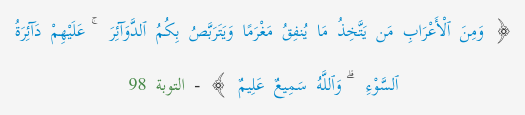


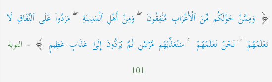


<h4 dir="rtl">"صلوة"</h4>

- أعاد النتائج التالية:

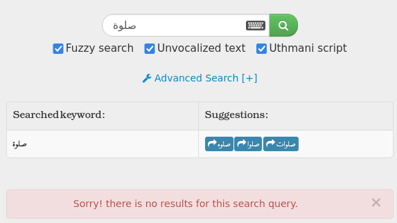

<h4 dir="rtl">"عقل"</h4>

- أعاد النتائج التالية:

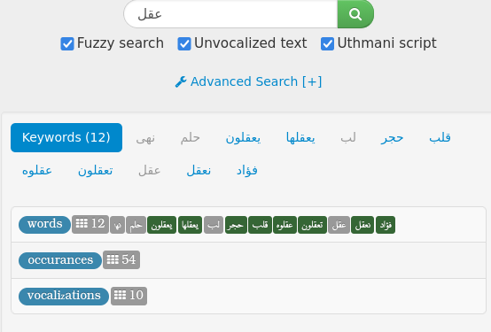


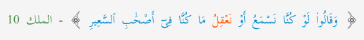


<h4 dir="rtl">"ألباب"</h4>

- أعاد النتائج التالية:


<h4 dir="rtl">"تل"</h4>

- أعاد الصفحة الرئيسية مع رابط غريب، لذا أتوقع أنه يواجه خطأ مع هذا الاستعلام.

<h4 dir="rtl">"جبل"</h4>

- أعاد النتائج التالية:

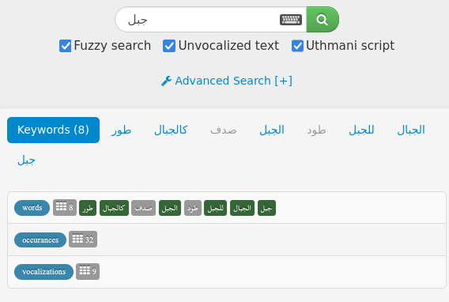

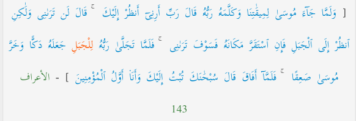


<h4 dir="rtl">"ربوة"</h4>

- أعاد النتائج التالية:


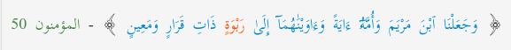

<h4 dir="rtl">"النيل"</h4>

- أعاد الصفحة الرئيسية مع رابط غريب، لذا أتوقع أنه يواجه خطأ مع هذا الاستعلام.

<h4 dir="rtl">"بحر"</h4>

- أعاد النتائج التالية:
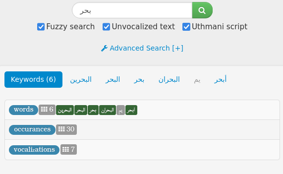


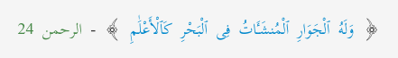
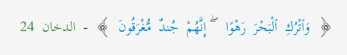


<h4 dir="rtl">"جمل"</h4>

- أعاد النتائج التالية:

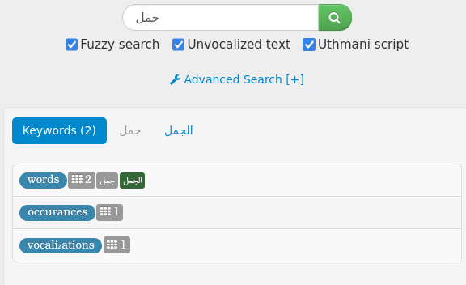

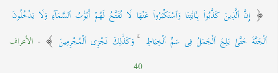

<h4 dir="rtl">"عصفور"</h4>

- أعاد النتائج التالية:

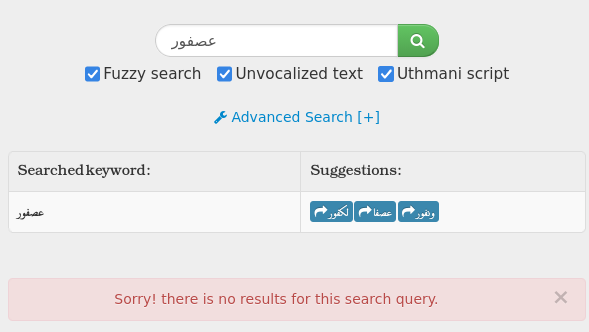

<h4 dir="rtl">"طير"</h4>

- أعاد النتائج التالية:


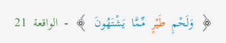
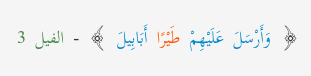
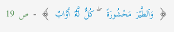


<h4 dir="rtl">"غراب"</h4>

- أعاد النتائج التالية:


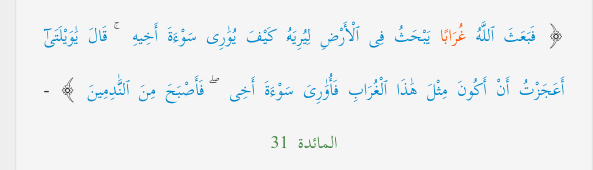
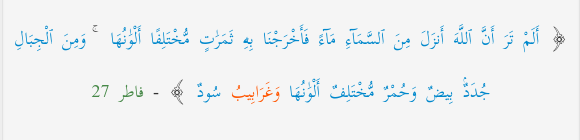

<h4 dir="rtl">"هدهد"</h4>

- أعاد النتائج التالية:

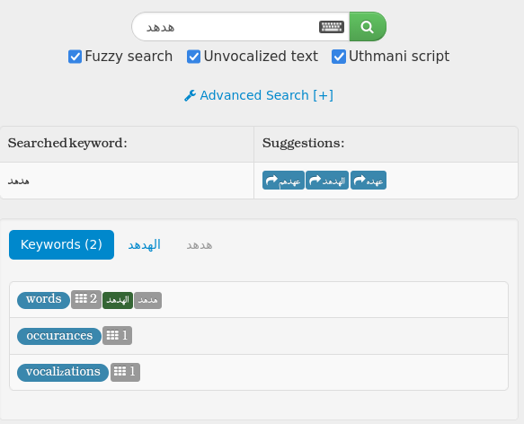

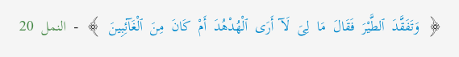


### kalimat

<h4 dir="rtl">"عرب"</h4>

- أعاد النتائج التالية:

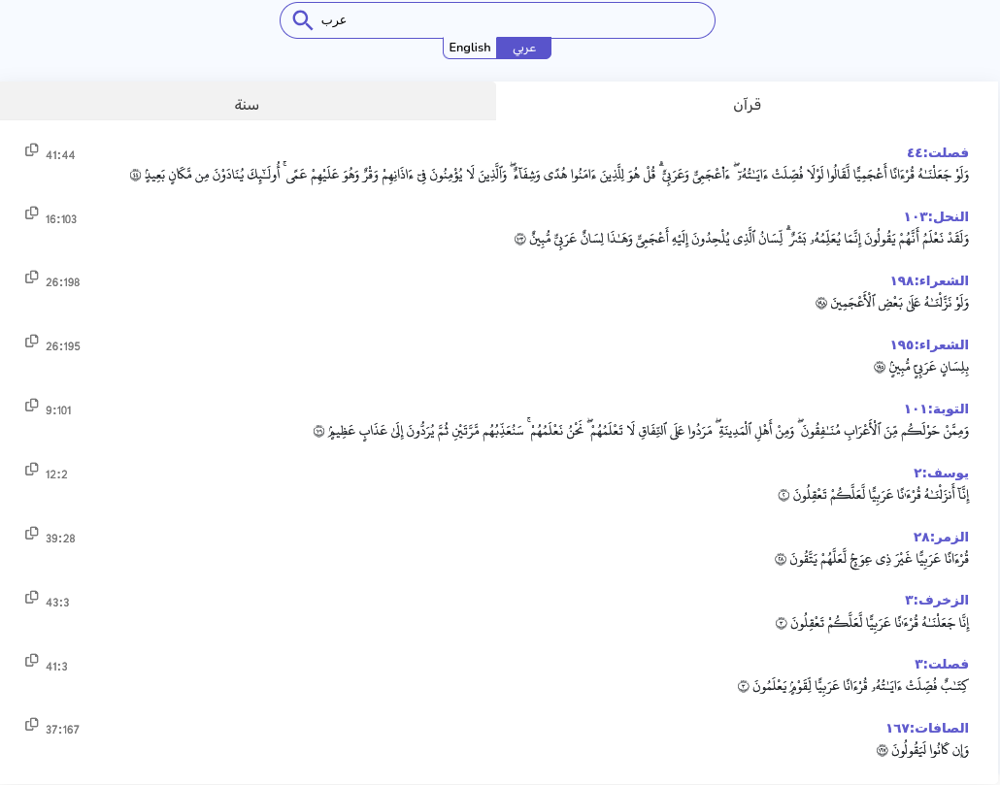

<h4 dir="rtl">"صلوة"</h4>

- أعاد النتائج التالية:

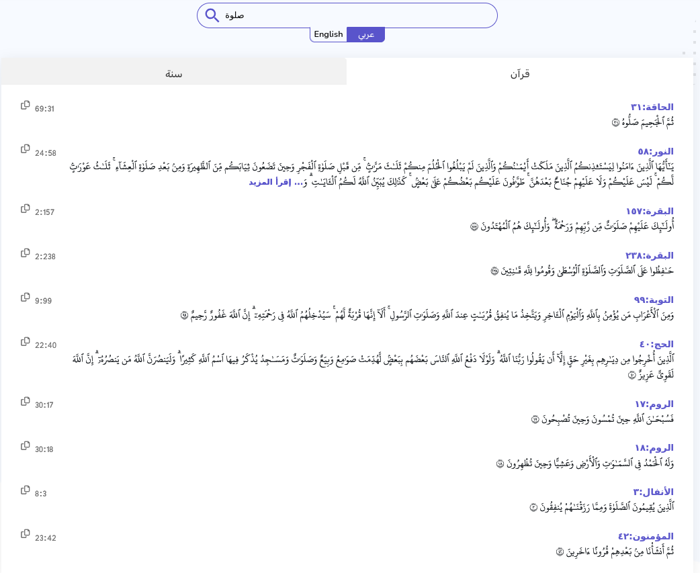

<h4 dir="rtl">"عقل"</h4>

- أعاد النتائج التالية:

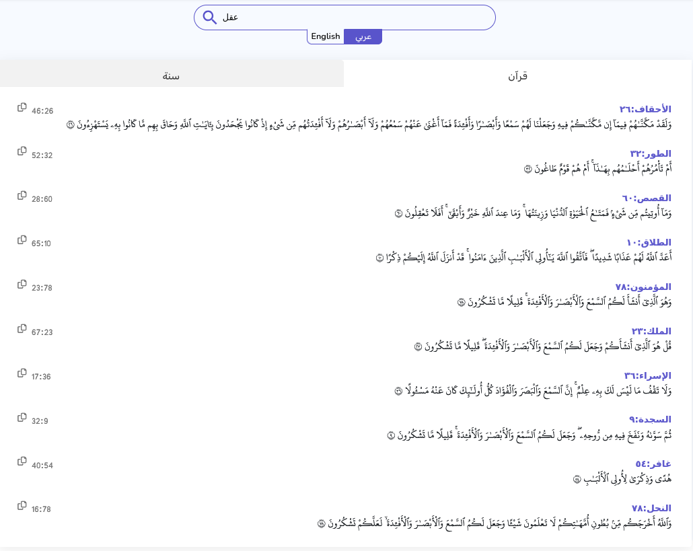

<h4 dir="rtl">"ألباب"</h4>

- أعاد النتائج التالية:


<h4 dir="rtl">"تل"</h4>

- أعاد النتائج التالية:

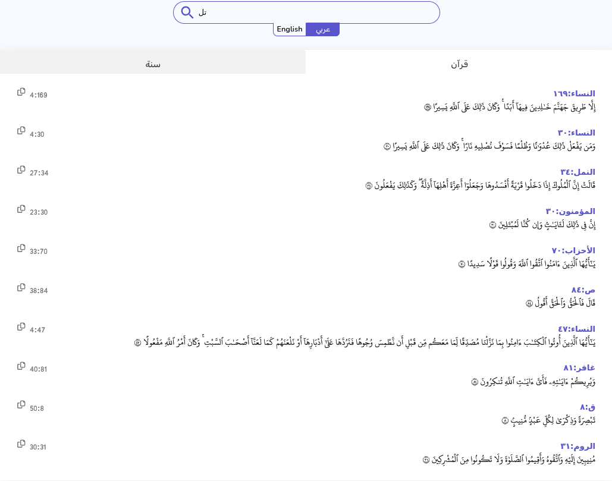

<h4 dir="rtl">"جبل"</h4>

- أعاد النتائج التالية:

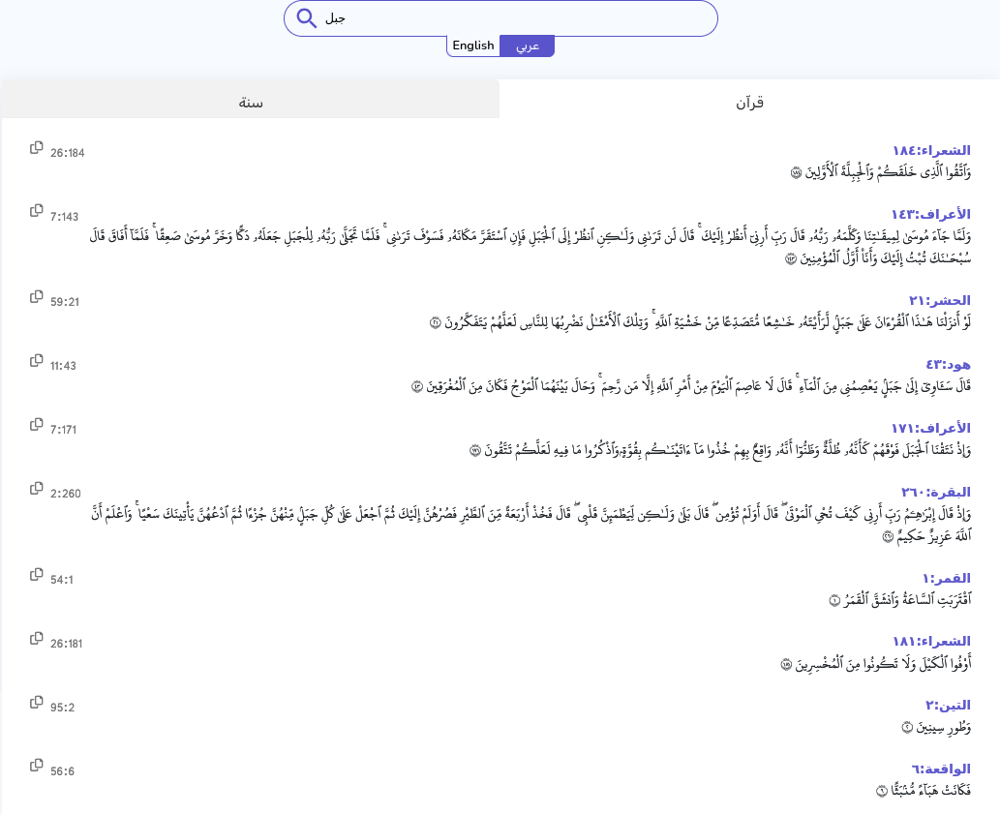

<h4 dir="rtl">"ربوة"</h4>

- أعاد النتائج التالية:


<h4 dir="rtl">"النيل"</h4>

- أعاد النتائج التالية:


<h4 dir="rtl">"بحر"</h4>

- أعاد النتائج التالية:


<h4 dir="rtl">"جمل"</h4>

- أعاد النتائج التالية:

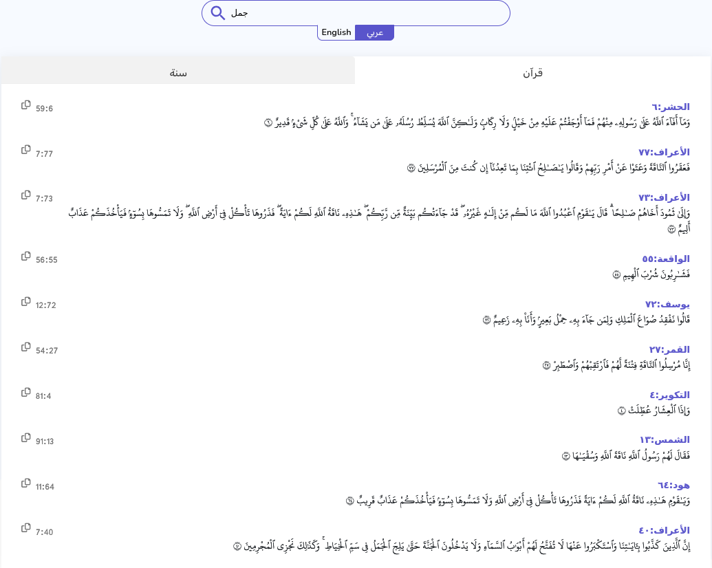

<h4 dir="rtl">"عصفور"</h4>

- أعاد النتائج التالية:


<h4 dir="rtl">"طير"</h4>

- أعاد النتائج التالية:

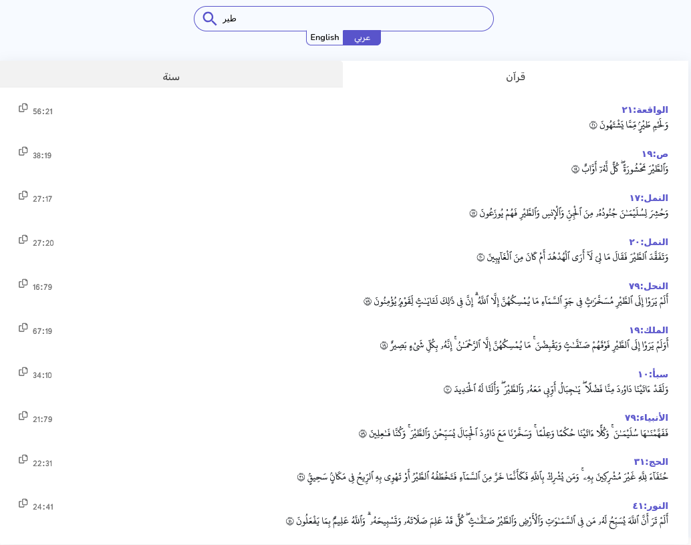

<h4 dir="rtl">"غراب"</h4>

- أعاد النتائج التالية:


<h4 dir="rtl">"هدهد"</h4>

- أعاد النتائج التالية:

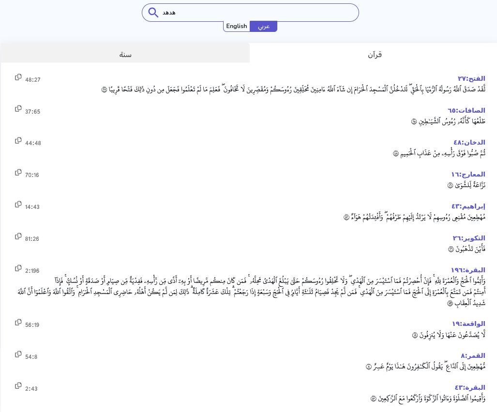

### quranic

- بالنسبة لـ quranic، إليك نتائج ملف الاختبار الذي توفره المكتبة:

```text
QUERY: its not the eyes that are blind, but the hearts

Surah Al-Mursalat (Those Sent Forth)
  (77:23) We ˹perfectly˺ ordained ˹its development˺. How excellent are We in doing so

Surah Al-Mudaththir (the Cloaked)
  (74:30) It is overseen by nineteen ˹keepers˺

Surah Al-An’am (the Cattle)
  (6:87) And ˹We favoured˺ some of their forefathers, their descendants, and their brothers. We chose them and guided them to the Straight Path

Surah Al-A’la (the Most High)
  (87:3) and Who ordained precisely and inspired accordingly

Surah Al-Kahf (the Cave)
  (18:81) So we hoped that their Lord would give them another, more virtuous and caring in his place

---------------------

QUERY: deaf dumb and blind

Surah Al-An’am (the Cattle)
  (6:87) And ˹We favoured˺ some of their forefathers, their descendants, and their brothers. We chose them and guided them to the Straight Path

Surah Al-Mursalat (Those Sent Forth)
  (77:23) We ˹perfectly˺ ordained ˹its development˺. How excellent are We in doing so

Surah As-Saffah (Those Ranges in Ranks)
  (37:118) and guided them to the Straight Path

Surah Al-Mu’minun (the Believers)
  (23:31) Then We raised another generation after them

Surah Al-‘Adiyah (the Runners)
  (100:3) launching raids at dawn

---------------------

QUERY: respecting and being dutiful to parents

Surah Yusuf (Yusuf)
  (12:43) And ˹one day˺ the King said, “I dreamt of seven fat cows eaten up by seven skinny ones; and seven green ears of grain and ˹seven˺ others dry. O chiefs! Tell me the meaning of my dream if you can interpret dreams.â€

Surah At-Taubah (the Repentance)
  (9:37) Reallocating the sanctity of ˹these˺ months is an increase in disbelief, by which the disbelievers are led ˹far˺ astray. They adjust the sanctity one year and uphold it in another, only to maintain the number of months sanctified by Allah, violating the very months Allah has made sacred. Their evil deeds have been made appealing to them. And Allah does not guide the disbelieving people

Surah Ar-Rum (the Romans)
  (30:41) Corruption has spread on land and sea as a result of what people’s hands have done, so that Allah may cause them to taste ˹the consequences of˺ some of their deeds and perhaps they might return ˹to the Right Path˺

Surah Al-A’raf (the Heights)
  (7:31) O Children of Adam! Dress properly whenever you are at worship. Eat and drink, but do not waste. Surely He does not like the wasteful

Surah Al-Mudaththir (the Cloaked)
  (74:30) It is overseen by nineteen ˹keepers˺

---------------------

QUERY: lusting after men

Surah Al-Mu’minun (the Believers)
  (23:42) Then We raised other generations after them

Surah Al-Mu’minun (the Believers)
  (23:31) Then We raised another generation after them

Surah Al-Mudaththir (the Cloaked)
  (74:2) Arise and warn ˹all˺

Surah Al-Layl (the Night)
  (92:4) Surely the ends you strive for are diverse

Surah Al-Isra’ (the Night Journey)
  (17:12) We made the day and night as two signs. So We made the sign of the night devoid of light, and We made the sign of the day ˹perfectly˺ bright, so that you may seek the bounty of your Lord and know the number of years and calculation ˹of time˺. And We have explained everything in detail
```

### QuranAnalysis

- النتائج هي:

<h4 dir="rtl">"عرب"</h4>

- أعاد النتائج التالية:

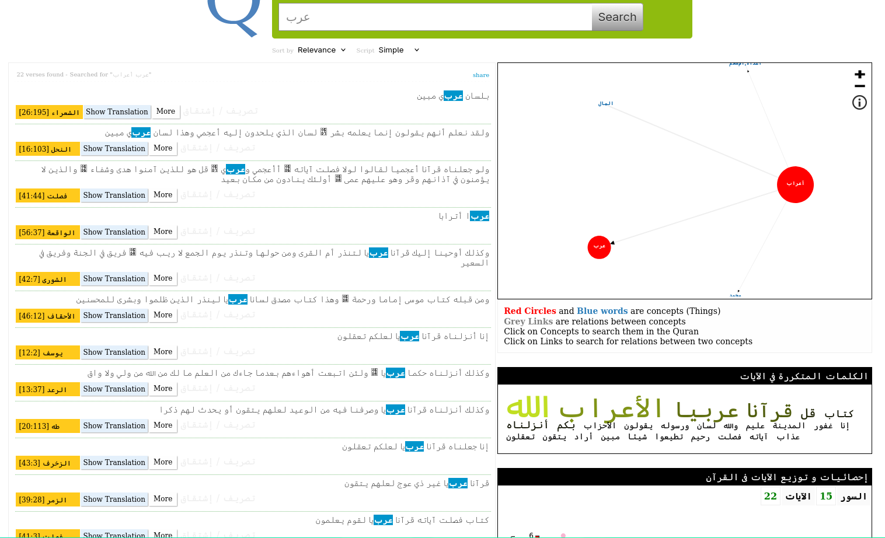

<h4 dir="rtl">"صلوة"</h4>

- أعاد النتائج التالية:


<h4 dir="rtl">"عقل"</h4>

- أعاد النتائج التالية:


<h4 dir="rtl">"ألباب"</h4>

- أعاد النتائج التالية:

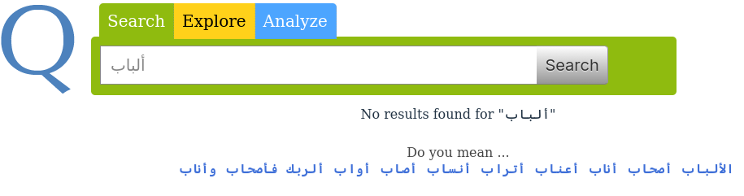

<h4 dir="rtl">"تل"</h4>

- أعاد النتائج التالية:

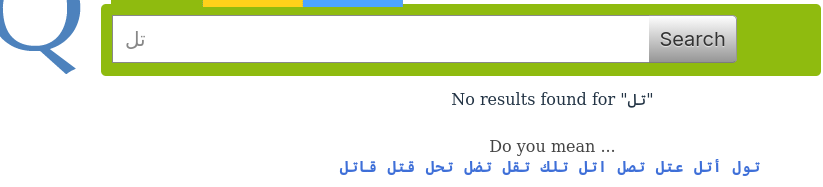

<h4 dir="rtl">"جبل"</h4>

- أعاد النتائج التالية:


<h4 dir="rtl">"ربوة"</h4>

- أعاد النتائج التالية:


<h4 dir="rtl">"النيل"</h4>

- أعاد النتائج التالية:


<h4 dir="rtl">"بحر"</h4>

- أعاد النتائج التالية:

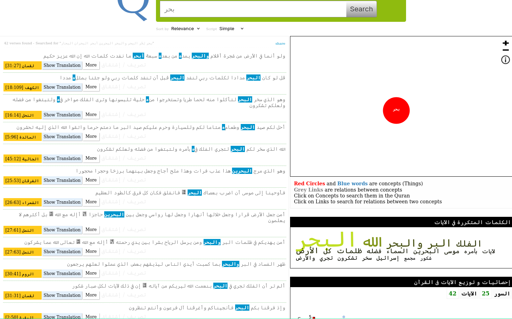

<h4 dir="rtl">"جمل"</h4>

- أعاد النتائج التالية:


<h4 dir="rtl">"عصفور"</h4>

- أعاد النتائج التالية:


<h4 dir="rtl">"طير"</h4>

- أعاد النتائج التالية:

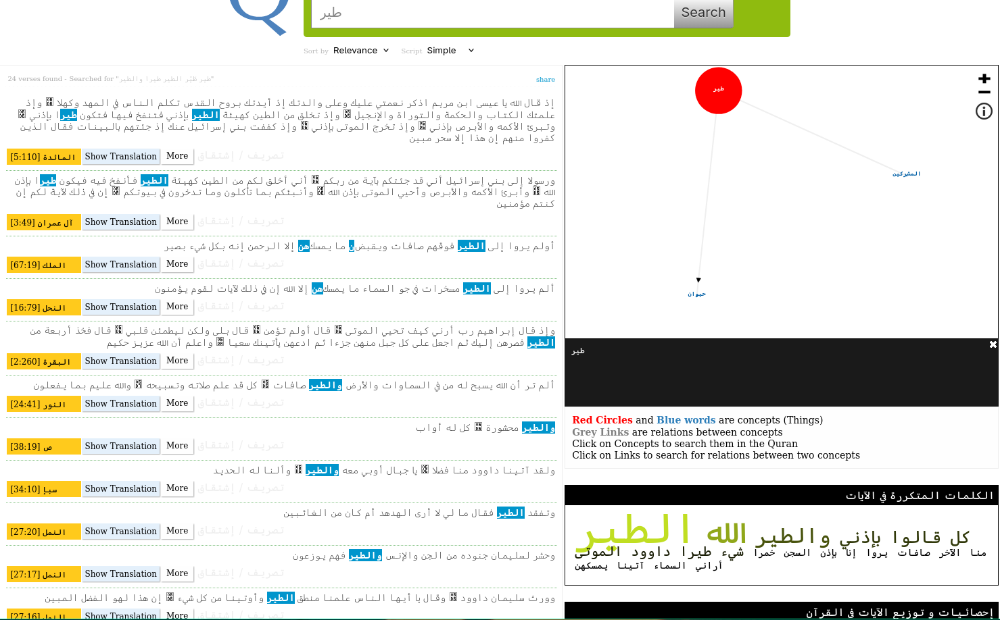

<h4 dir="rtl">"غراب"</h4>

- أعاد النتائج التالية:


<h4 dir="rtl">"هدهد"</h4>

- أعاد النتائج التالية:

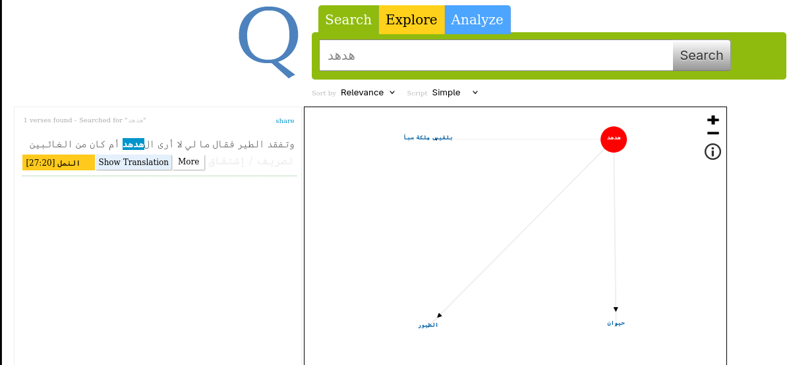


### quranic-search-v2


- النتائج هي:

<h4 dir="rtl">"عرب"</h4>

- أعاد النتائج التالية:


<h4 dir="rtl">"صلوة"</h4>

- أعاد النتائج التالية:

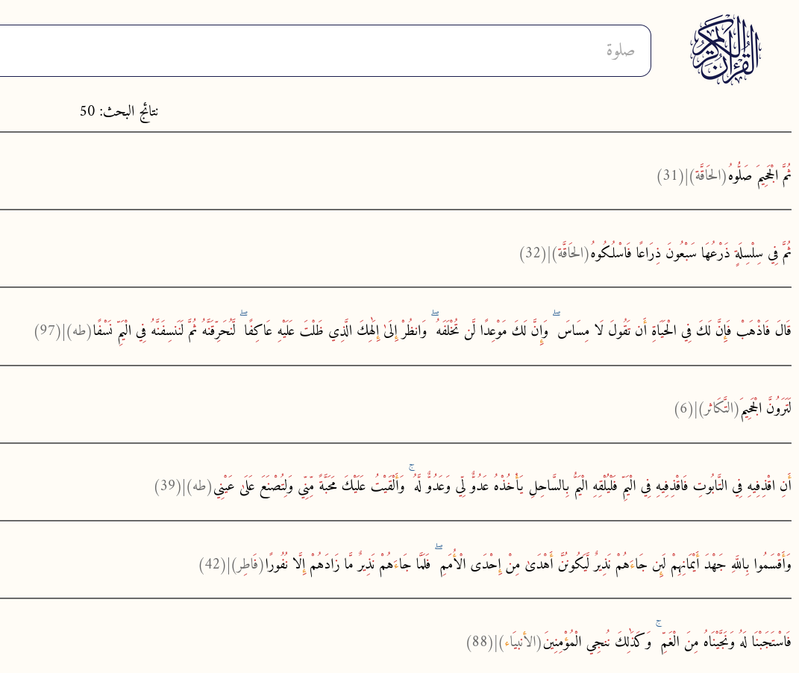

<h4 dir="rtl">"عقل"</h4>

- أعاد النتائج التالية:

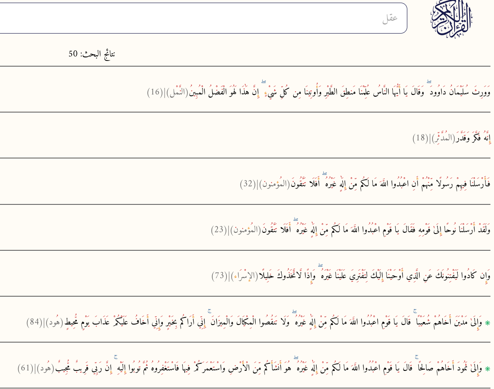

<h4 dir="rtl">"ألباب"</h4>

- أعاد النتائج التالية:

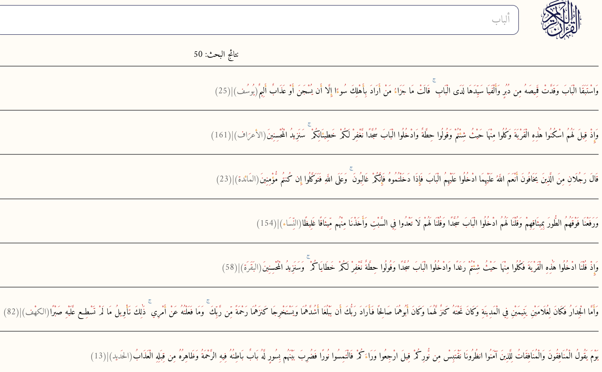

<h4 dir="rtl">"تل"</h4>

- أعاد النتائج التالية:

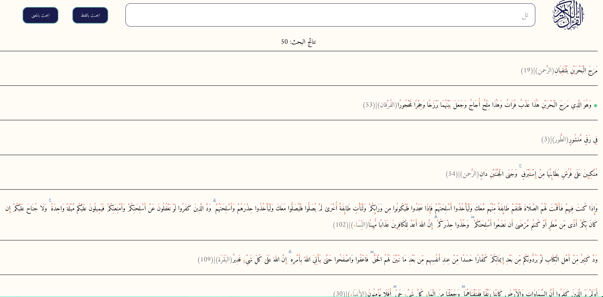

<h4 dir="rtl">"جبل"</h4>

- أعاد النتائج التالية:


<h4 dir="rtl">"ربوة"</h4>

- أعاد النتائج التالية:


<h4 dir="rtl">"النيل"</h4>

- أعاد النتائج التالية:

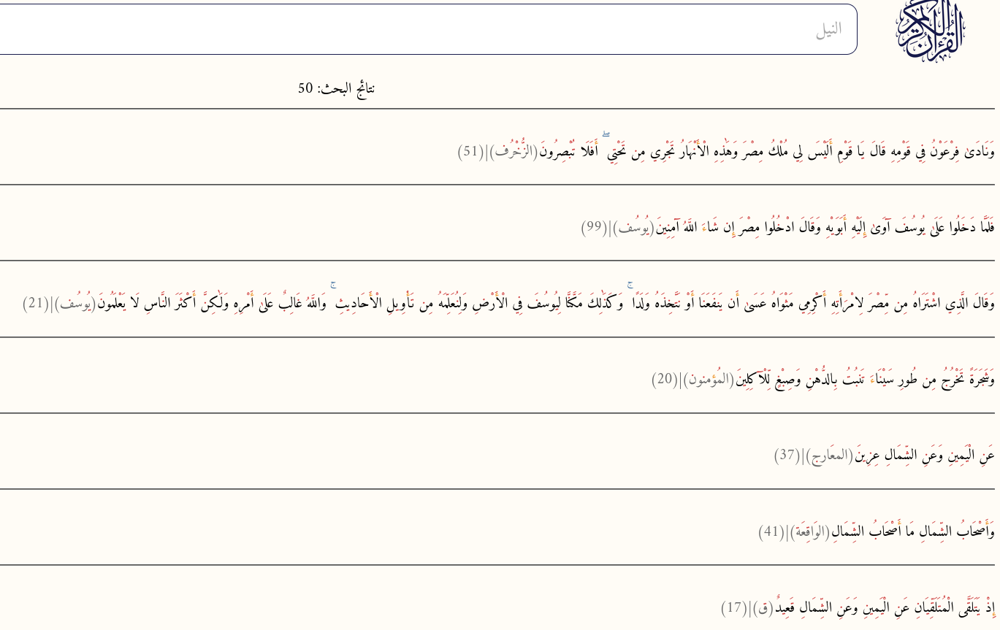

<h4 dir="rtl">"بحر"</h4>

- أعاد النتائج التالية:

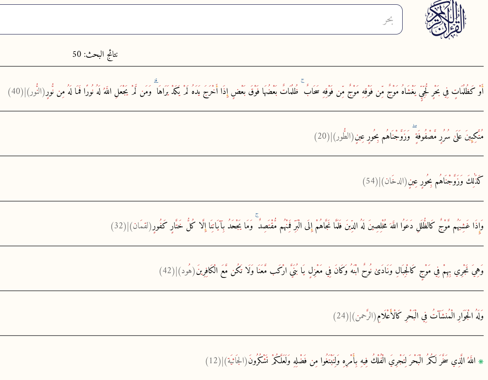

<h4 dir="rtl">"جمل"</h4>

- أعاد النتائج التالية:

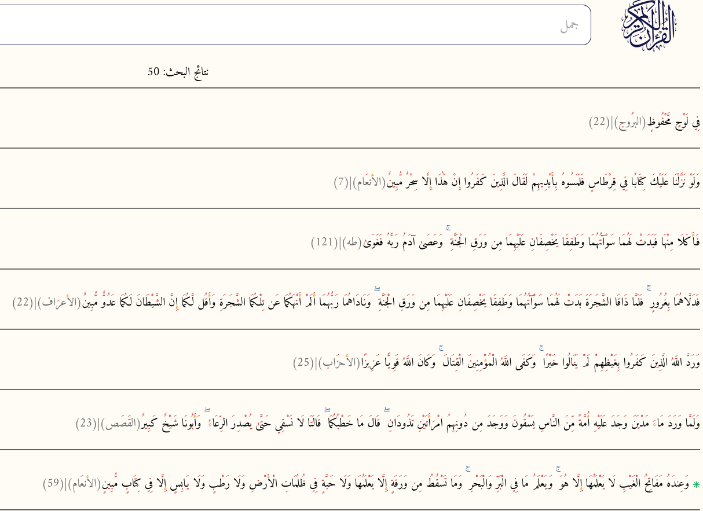

<h4 dir="rtl">"عصفور"</h4>

- أعاد النتائج التالية:

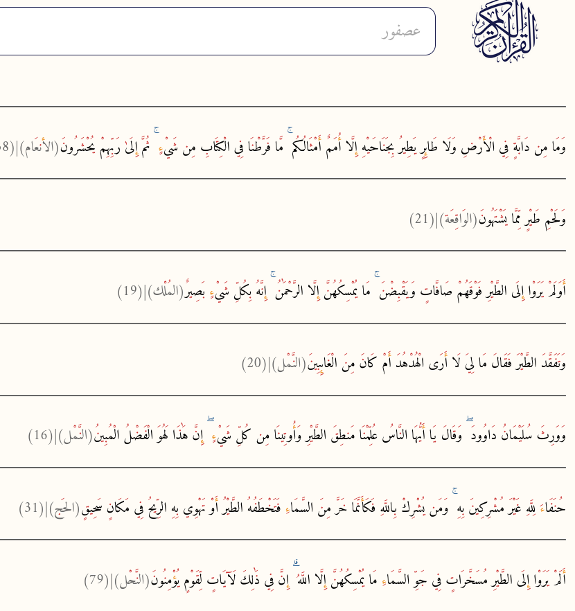

<h4 dir="rtl">"طير"</h4>

- أعاد النتائج التالية:


<h4 dir="rtl">"غراب"</h4>

- أعاد النتائج التالية:

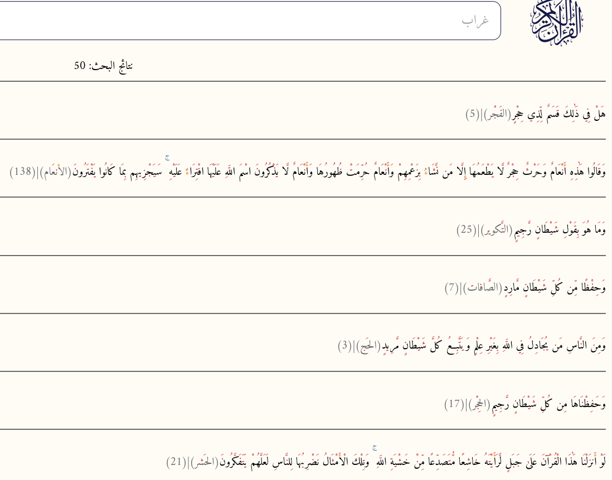

<h4 dir="rtl">"هدهد"</h4>

- أعاد النتائج التالية:

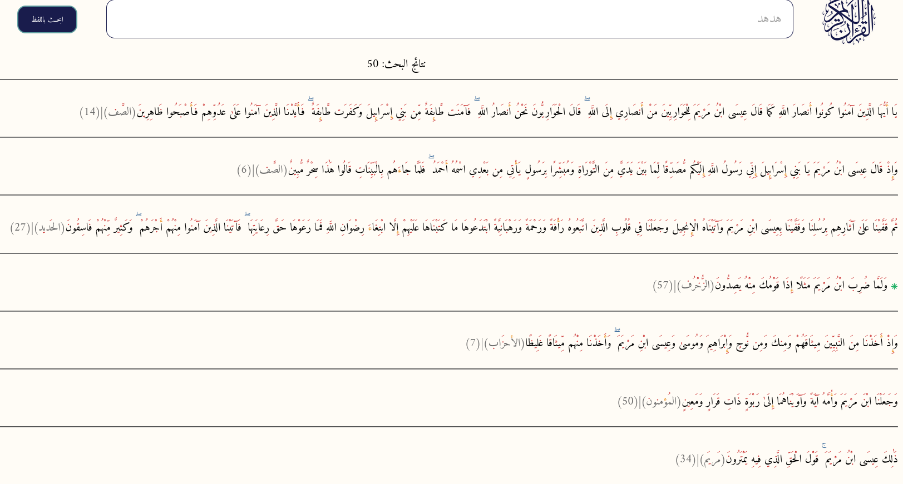
